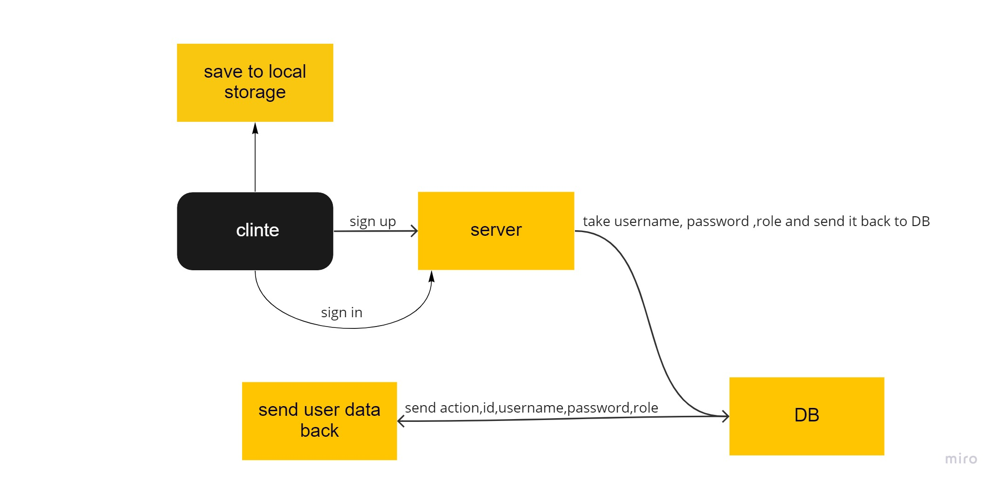

# auth-api

## My notes


**this server can  respond to the following routes:**
+ POST `/signup` to create an account
+ POST `/signin` to login with Basic Auth
+ GET `/secret` that require a valid bearer token
+ GET `/user` require a valid token and “delete” permissions
+ create `/user`
+ update `/user`
+ delete `/user`


**Middleware for handling 404 and 500 conditions**

**Middleware for handling each type of authentication**
+ basic.js
+ bearer.js
+ oauth.js/acl

**Data Types**
+ `username: Type: String, Required false`
+ `password: Type: String, Required false`

+ `role: type: DataTypes.ENUM('admin', 'writer', 'editor', 'user'),` 


+ `token:type: DataTypes.VIRTUAL`
+ `actions:type: DataTypes.VIRTUAL`

```js
get() {
                const acl = {
                    user: ['read'],
                    writer: ['read', 'create'],
                    editor: ['read', 'create', 'update'],
                    admin: ['read', 'create', 'update', 'delete'],
                }
                return acl[this.role];
            }

```

## UML



+ [heruko]()
+ [pull req]()
+ [actions]()


